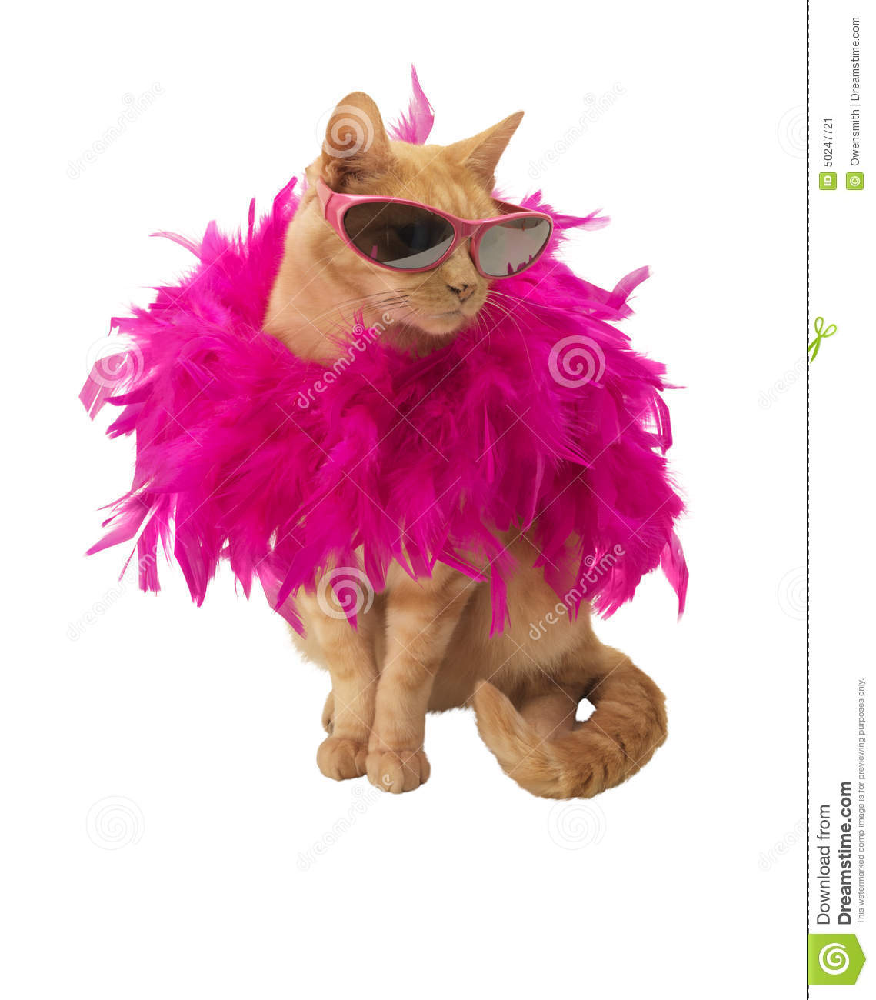

# Le chat à plumes!

 
Il était une fois dans les rues de Londres, un chat pas comme les autres.
Il n'était pas couvert de poils mais bien de plumes!
Son camouflage était parfait pour attrapper les oiseaux dans les environs.
Mais il ne savait pas que les piegons
Sont des animaux dangereux
Il se fit lacérer le ***... et s'enfuit
Malgré les efforts pour s'enfuir et échapper à ses ravisseurs, le chats était à bout de souffle.
Les pigeons, une bande de déliquants reconnus dans tout le quartier de Londres, étaient si cruels que même les passants se cachaient quand ils les voyaient.
jusqu'a ce jour personne n'osa les confronter mais ca c'etait sans compter sur l'arriver roucoups dans la ville
